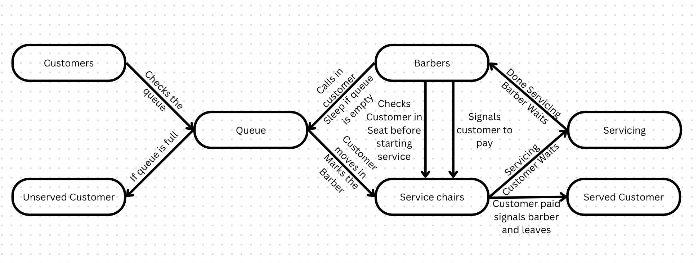

# The Extended Sleeping Barbers Problem

This project simulates the multiple sleeping barbers problem using C++ and POSIX threads (pthreads). The simulation models a barber shop with multiple barbers, a limited number of waiting chairs, and customers arriving randomly to get haircuts.

## Table of Contents
- [Getting Started](#getting-started)
- [Usage](#usage)
- [Implementation Details](#implementation-details)
- [Design Diagram](#design-diagram)
- [Classes and Functions](#classes-and-functions)
- [Dependencies](#dependencies)
- [Limitations and Possible Extensions](#limitations-and-possible-extensions)

## Getting Started

### Prerequisites

Make sure you have a C++ compiler and POSIX threads library installed on your system. For Linux, you can use `g++` and the `pthread` library.

### Installation

Clone the repository to your local machine:

git clone https://github.com/yourusername/multiple-sleeping-barbers.git
cd multiple-sleeping-barbers

### Building

To build the project, use the following command:

g++ -o barber_shop driver.cpp shop_org.cpp -lpthread

## Usage

Run the compiled program with the following command:

./barber_shop <num_barbers> <num_chairs> <num_customers> <service_time>

- `num_barbers`: The number of barbers in the shop.
- `num_chairs`: The number of waiting chairs in the shop.
- `num_customers`: The total number of customers arriving at the shop.
- `service_time`: The time each barber takes to service a customer (in milliseconds).

Example:

./barber_shop 3 5 20 1000

## Implementation Details

The project consists of the following files:

- `driver.cpp`: Contains the main function and thread functions for barbers and customers.
- `shop_org.cpp`: Implements the core logic of the barber shop, including customer visits and barber actions.
- `shop_org.h`: Contains the class definition for `Shop_org`, managing the synchronization and state of the shop.

### Synchronization

The project uses mutexes and condition variables to synchronize the actions of barbers and customers. Key aspects include:
- Barbers wait for customers to arrive and then service them.
- Customers either wait for an available barber or leave if no waiting chairs are available.
- Barbers wait for payment after servicing a customer before moving on to the next customer.

## Design Diagram

## Classes and Functions

### `class Shop_org`

#### Members
- `max_waiting_cust_`: The maximum number of waiting customers.
- `waiting_chairs_`: A queue holding the IDs of waiting customers.
- `cust_drops_`: The number of customers who left without service.
- `num_barbers`: The number of barbers.
- `in_service_`: A vector indicating which barbers are currently servicing customers.
- `money_paid_`: A vector indicating if a barber has been paid.
- `customer_in_chair_`: A vector holding the IDs of customers being serviced.

#### Methods
- `visitShop(int id)`: Manages customer arrival.
- `leaveShop(int id)`: Manages customer departure.
- `helloCustomer(int barber_id)`: Called by barbers to start servicing a customer.
- `byeCustomer(int barber_id)`: Called by barbers after servicing a customer.
- `get_cust_drops()`: Returns the number of customers who didn't receive service.

## Dependencies
- C++
- POSIX Threads (pthreads)

## Limitations and Possible Extensions

The current program does not consider time constraints for customers. In a more realistic scenario, customers may have limited patience and may leave if they have to wait too long. An extension could involve introducing a timeout mechanism where customers leave the shop after a certain waiting time.

Another limitation that is pretty important is that there is not fairness for the barbers considered in the current program. The customer would find the first available barber and wait for their service. An extension would be adding a priority queue to make sure that the least serviced barber to have priority to give the next customer service. 

The current program does not handle exceptional scenarios, such as thread failures or resource allocation errors. An extension could involve adding error-handling mechanisms to gracefully handle and recover from such situations.

In terms of performance, there are no optimization techniques implemented. The extension that I can think of could be use of thread pooling techniques to decrease overhead. In terms of HPC techniques we can try to minimize branches and unroll the loops in future implementations.
